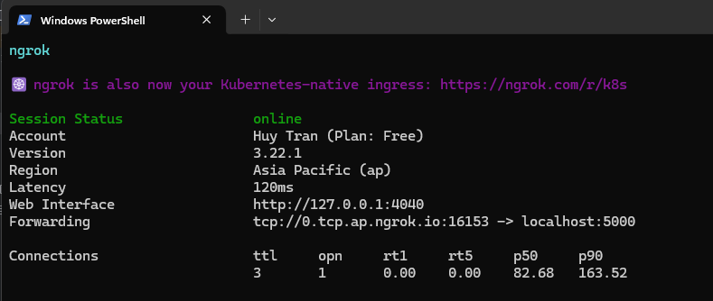

### To run both server and client on the same machine:
- To run server: `python server.py --host 127.0.0.1 --port 5000`
- To run client: `python client.py 127.0.0.1 5000`
Run both server and client in separate terminals.

### - To run server and client on 2 different machines and networks:
### Use ngrok: 
- `choco install ngrok`
- `ngrok config add-authtoken <your_auth_token>`
- `ngrok tcp 5000` (to run with tcp protocol)

- Use the tcp forwarding address to run the client with the command: `python client.py <tcp_forwarding_address> <port>`
- For example: `python client.py 0.tcp.ap.ngrok.io 12345`