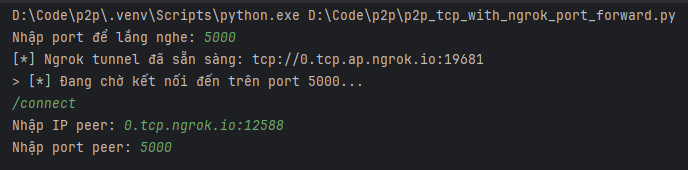

## P2P TCP File Transfer with Ngrok Port Forwarding

### Config the Ngrok tunnel
- Download Ngrok from [ngrok.com](https://ngrok.com/download) then setup like documents
- Login to your Ngrok account and get the authtoken to config Ngrok on your machine

### To run on the same machine:
- Terminal 1: `python p2p_tcp_with_ngrok_port_forward.py`
  - Input the port number to listen on (e.g., 5000)
  - You will see the Ngrok forwarding address (e.g., 0.tcp.ap.ngrok.io:12345)
- Terminal 2: `python p2p_tcp_with_ngrok_port_forward.py`
  - Input the port number as in Terminal 1 (different from the one in Terminal 1)
  - Use `/connect` command to connect to the Ngrok forwarding address
  - Input the Ngrok forwarding address from Terminal 1 (e.g., 0.tcp.ap.ngrok.io:12345)
  - Input the port number from Terminal 1 (e.g., 5000)
  - Use `/sendfile` command to send a file

### - To run server and client on 2 different machines and networks:
- Machine 1:
  - Run: `python p2p_tcp_with_ngrok_port_forward.py`
    - Input the port number to listen on (e.g., 5000)
    - You will see the Ngrok forwarding address (e.g., 0.tcp.ap.ngrok.io:12345)
- Machine 2:
  - Run: `python p2p_tcp_with_ngrok_port_forward.py`
    - Input the port number as in Machine 1
    - Use `/connect` command to connect to the Ngrok forwarding address
    - Input the Ngrok forwarding address from Machine 1 (e.g., 0.tcp.ap.ngrok.io:12345)
    - Input the port number from Machine 1 (e.g., 5000)
    - Use `/sendfile` command to send a file
- Example:
 